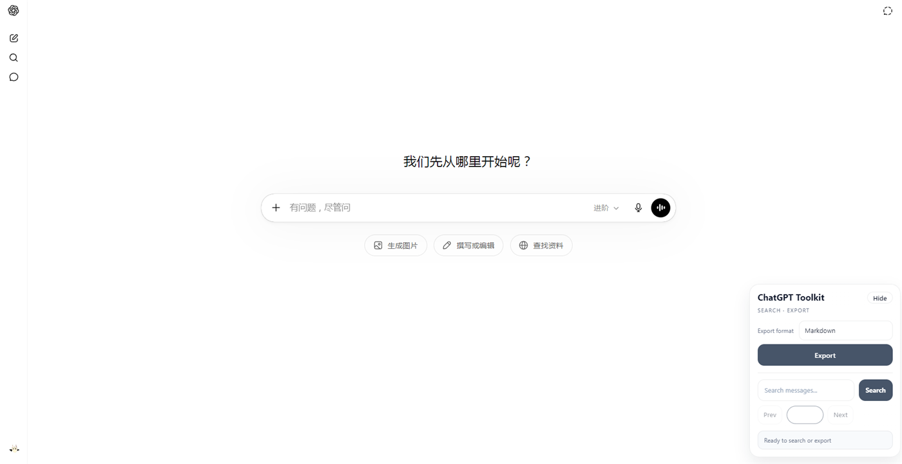
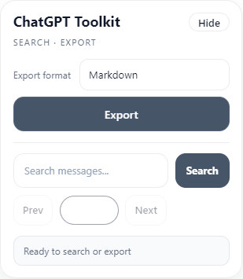
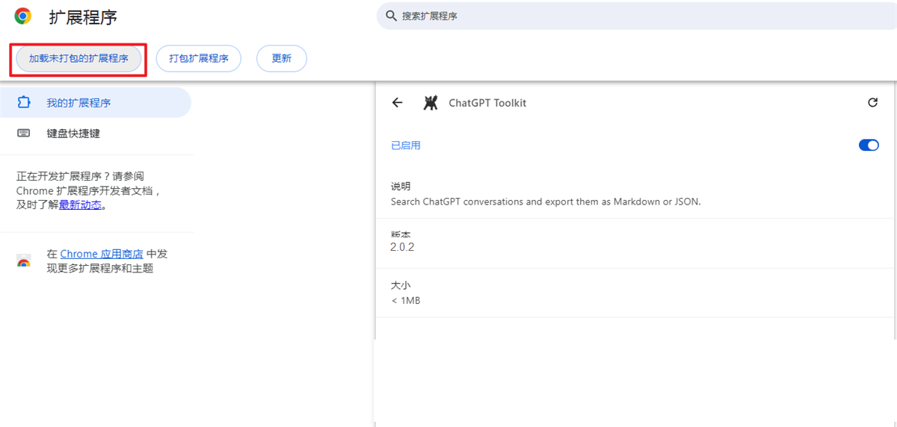
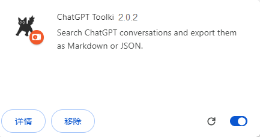

# ChatGPT Conversation Export

<p align="center">
  <a href="./README.md"></a>
  <a href="./README.en.md"></a>
  <a href="./LICENSE"></a>
</p>

ChatGPT Conversation Export 是一个面向 **Chrome 与 Microsoft Edge** 的 ChatGPT 会话导出扩展。它通过 Chromium 内置的 `chrome.debugger` API 捕获 ChatGPT 页面自身加载的完整会话数据，将当前对话快速导出为 Markdown 或 JSON。

扩展的核心目标是避免依赖虚拟化 DOM 和页面滚动。即使长会话只在页面中渲染部分消息，导出仍可保留完整的用户消息、助手回复、代码块、Mermaid 源码和 LaTeX 公式。

> 完整导出会刷新当前 ChatGPT 会话一次，并在导出期间临时附加 Chromium 调试器。导出完成后会自动断开。



## ✨ 功能特点

- 完整导出当前 ChatGPT 会话，不依赖页面滚动。
- 支持 Markdown 和 JSON 两种导出格式。
- 文件名自动使用 `对话名称-YYMM.md` 或 `对话名称-YYMM.json`。
- 保留助手原始 Markdown 内容。
- 保留 fenced code block、Mermaid 源码和 LaTeX 公式。
- 支持当前会话消息搜索、文本高亮和上一条/下一条跳转。
- 工具栏默认收起为右下角 `GPT` 悬浮按钮。
- 自动跟随 ChatGPT 明暗主题。
- 支持 Chrome 和 Microsoft Edge。

<p align="center">
  
</p>

## 🧩 使用环境

- Chromium Manifest V3
- Google Chrome
- Microsoft Edge
- `https://chatgpt.com/*`
- `https://chat.openai.com/*`

当前完整导出方案依赖 Chromium 的 `chrome.debugger` API，因此不支持 Firefox。

## 📦 安装方法

### Chrome

1. 打开 `chrome://extensions/`。
2. 开启“开发者模式”。
3. 点击“加载已解压的扩展程序”。
4. 选择本项目根目录。
5. 接受扩展权限。



<p align="center">
  
</p>

### Microsoft Edge

1. 打开 `edge://extensions/`。
2. 开启“开发人员模式”。
3. 点击“加载解压缩的扩展”。
4. 选择本项目根目录。
5. 接受扩展权限。

Chrome 和 Edge 均基于 Chromium，因此安装方式和完整导出原理一致。

## 🔐 浏览器权限与调用方式

扩展声明以下高权限：

- `debugger`：临时读取当前 ChatGPT 标签页自身的会话网络响应。
- `downloads`：下载生成的 Markdown 或 JSON 文件。
- `tabs`：在页面刷新后发送导出结果状态。

权限不会在浏览器启动后持续调用。只有用户主动点击 `Export` 时，后台 Service Worker 才会对**当前 ChatGPT 标签页**执行以下流程：

```text
点击 Export
  -> chrome.runtime.sendMessage 通知后台 Service Worker
  -> chrome.debugger.attach 临时附加当前 ChatGPT 标签页
  -> Network.enable 并刷新当前会话
  -> 捕获并解析当前会话的完整网络响应
  -> chrome.downloads.download 保存导出文件
  -> chrome.debugger.detach 自动断开
```

扩展不会读取其他标签页的网络响应，也不会持续保持调试器连接。成功、失败或超时后都会尝试自动断开。导出期间浏览器可能显示“调试器已附加”提示，这是 Chromium 对 `chrome.debugger` API 的正常安全提示。

## 🚀 使用方法

1. 打开需要导出的 ChatGPT 会话。
2. 点击右下角 `GPT` 悬浮按钮展开工具栏。
3. 选择 `Markdown` 或 `JSON`。
4. 点击 `Export`。
5. 当前会话会刷新一次，导出完成后文件自动下载。

导出过程不再滚动页面。切换到其他标签页不会影响网络响应捕获。

## 📝 输出文件命名

导出文件默认使用：

```text
对话名称-YYMM.md
对话名称-YYMM.json
```

例如，标题为 `python`、导出时间为 2026 年 6 月时，文件名为 `python-2606.md`。

命名时优先读取完整会话响应中的 `conversation.title`；若无法取得，则使用当前 ChatGPT 页面标题。文件名中的 Windows 非法字符会自动替换，避免下载失败。

## 📄 导出内容

### Markdown

Markdown 文件按会话顺序保存消息：

```markdown
# ChatGPT Conversation

- Exported: 2026-06-04T00:00:00.000Z
- Source: https://chatgpt.com/c/...
- Messages: 126

## 1. User

用户消息

## 2. Assistant

助手回复
```

助手原始回复中的 Mermaid 和 LaTeX 会保留为 Markdown 源码，例如：

````markdown


行内公式：$E = mc^2$

单行公式：

$$
E = mc^2
$$
````

### JSON

JSON 文件包含导出元数据和完整消息数组：

```json
{
  "exportedAt": "2026-06-04T00:00:00.000Z",
  "url": "https://chatgpt.com/c/...",
  "exportSource": "chromium-debugger-network",
  "messageCount": 126,
  "messages": [
    {
      "index": 1,
      "role": "user",
      "text": "..."
    }
  ]
}
```

## 🔎 搜索功能

- 在当前已渲染消息中搜索文本。
- 高亮匹配内容。
- 使用 `Prev` 和 `Next` 在结果之间跳转。

搜索功能依赖当前页面已渲染的消息；完整导出不受此限制。

## ⚙️ 工作原理

```text
用户点击 Export
  -> 后台 Service Worker 附加 chrome.debugger
  -> 刷新当前 ChatGPT 会话
  -> 监听并解析页面自身的完整会话网络响应
  -> 沿当前会话分支整理 User / Assistant / System 消息
  -> 生成 Markdown 或 JSON
  -> 下载文件并自动断开调试器
```

## ⚠️ 已知限制

- ChatGPT 私有网络响应结构发生变化时，完整导出解析可能需要同步更新。
- 浏览器会在导出期间显示调试器附加提示。
- 若其他 DevTools 或调试器已附加当前标签页，导出可能失败。
- 当前导出当前选中的会话分支，不同时导出所有历史分叉。
- 搜索仅覆盖当前页面已渲染内容。
- 当前完整导出不支持 Firefox。

## 🗂️ 项目结构

```text
background.js          Chromium debugger 网络捕获与文件下载
contentScript.js       页面初始化与状态消息
core/                  全局状态与英文界面文本
features/export.js     导出入口与旧 DOM 后备工具
features/search.js     当前页面消息搜索
ui/                    工具栏、悬浮按钮与主题同步
utils/                 DOM、格式提取与轻量状态工具
image/                 扩展图标
manifest.json          Manifest V3 配置
styles.css             工具栏与搜索界面样式
```

## 📌 版本说明

### 当前版本：v2.0.2

- 使用 Chromium debugger 网络响应完成完整会话导出。
- 支持 Markdown 与 JSON。
- 使用会话标题生成文件名。
- 支持 Chrome 与 Microsoft Edge。
- 保留原始 Mermaid、LaTeX 和代码块。
- 保留当前页面消息搜索功能。

## 📜 许可证

本项目采用 [MIT License](./LICENSE)。
